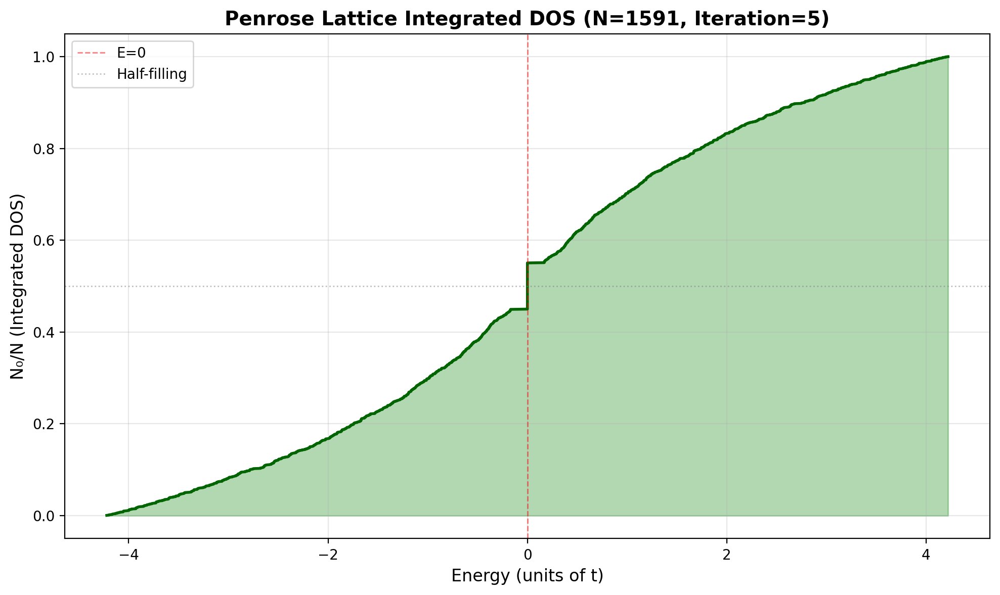
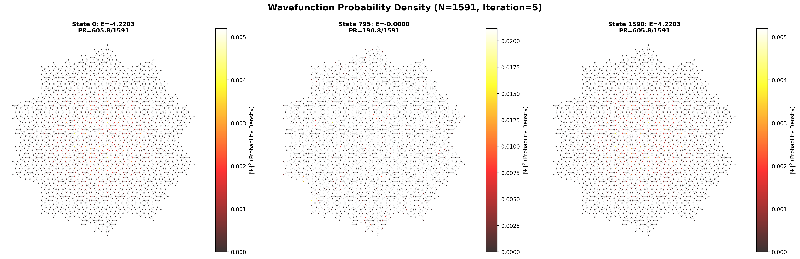

# Penrose Lattice Tight Binding Model - Documentation

## Overview

Implementation of tight binding model for Penrose lattice using the deflation method. This project includes an optimized lattice generator and complete tight binding analysis with bipartite wavefunction visualization.

## File Structure

### Directory Organization
```
/workspaces/HU/
├── data/                          # Data files
│   ├── penrose_lattice_data.pkl   # Lattice data (pickle format)
│   └── penrose_lattice_data.npz   # Lattice data (numpy format)
├── imgs/                          # Output images
│   ├── penrose_all_iterations_fast.png
│   ├── penrose_iter0_iter1_overlapped_fast.png
│   ├── penrose_energy_spectrum.png
│   ├── penrose_dos.png
│   ├── penrose_idos.png
│   ├── penrose_wavefunctions_E0.png
│   ├── penrose_deflation.gif
│   └── penrose_bfs_coloring.gif
├── penrose_tiling_fast.py         # Lattice generator
├── penrose_tight_binding.py       # Tight binding analysis (CPU)
├── penrose_tight_binding_cupy.py  # Tight binding analysis (GPU)
├── jupyter_penrose.ipynb          # Interactive notebook
├── tight_binding_penrose_report.pdf  # Project report
└── README.md                      # This file
```

### 1. `penrose_tiling_fast.py`
**Function**: Generate Penrose lattice using optimized deflation algorithm
**Features**:
- Spatial hashing for O(1) vertex lookup (500x+ speedup)
- Batch processing for edge operations
- Optional plotting with `--plot` flag

**Output**: 
- `data/penrose_lattice_data.pkl` - Data in pickle format
- `data/penrose_lattice_data.npz` - Data in numpy format
- `imgs/penrose_all_iterations_fast.png` - Plot of all iterations (if `--plot`)
- `imgs/penrose_iter0_iter1_overlapped_fast.png` - Overlapped plot of iterations 0 and 1 (if `--plot`)

**Saved data structure**:
```python
{
    'vertices': Dict[int, np.array([x, y])],  # Vertex coordinates
    'edges': Dict[(i, j), arrow_type],        # Connections between vertices
    'N': int,                                  # Number of vertices
    'E': int,                                  # Number of edges
    'iteration': int,                          # Deflation iteration
    'phi': float,                              # Golden ratio
    'single_arrows': int,                      # Number of single arrows
    'double_arrows': int                       # Number of double arrows
}
```

### 2. `penrose_tight_binding.py`
**Function**: Hamiltonian tight binding diagonalization with wavefunction analysis
**Input**: `data/penrose_lattice_data.pkl` or `data/penrose_lattice_data.npz`
**Output**:
- `imgs/penrose_energy_spectrum.png` - Energy spectrum plot (DPI 200)
- `imgs/penrose_dos.png` - Density of States plot (DPI 200)
- `imgs/penrose_idos.png` - Integrated Density of States plot (DPI 200)
- `imgs/penrose_wavefunctions_E0.png` - Zero-energy wavefunction plots (DPI 500)

**New Features**:
- Bipartite sublattice detection (BFS algorithm)
- Wavefunction visualization with sublattice coloring (red/blue)
- Plot rotation -18° for optimal orientation
- Threshold-based sizing for highlighting
- Zero-energy state analysis and visualization

## Tight Binding Model

### Hamiltonian
$$H = \sum_i \epsilon_0 |i\rangle\langle i| - t \sum_{\langle i,j \rangle} (|i\rangle\langle j| + |j\rangle\langle i|)$$

Where:
- $\epsilon_0 = 0$ (on-site energy)
- $t = 1$ (hopping parameter)
- $\langle i,j \rangle$ indicates nearest neighbors (connected by edges)

### Properties

**Matrix**: Hermitian, real symmetric
**Size**: N×N (N = number of vertices)
**Sparsity**: ~2E/N² (only nearest neighbor)

### Results (Iteration 2, N=86)

| Property | Value |
|----------|-------|
| Vertices (N) | 86 |
| Edges (E) | 150 |
| Bandwidth | 7.949 |
| Energy range | [-3.975, 3.975] |
| Zero-energy states | 8 |
| Mean energy | 0.0 (by symmetry) |

### Physical Interpretation

1. **Particle-hole symmetry**: Spectrum symmetric around E=0
2. **Extended states**: High participation ratio (~40% of lattice)
3. **Quasiperiodic structure**: Non-degenerate energy levels
4. **No band gaps**: Continuous DOS (unlike periodic lattices)

## Usage

### 1. Generate Penrose Lattice
```bash
# Generate lattice data only (fast)
python penrose_tiling_fast.py

# Generate lattice data with plots
python penrose_tiling_fast.py --plot
```

**Performance**: Iteration 5 (~11,000 vertices) in ~2 seconds (524x faster than original method)

#### Example Output: Iteration 4


The figure shows the first four iterations of the Penrose lattice construction using the deflation method. Each iteration multiplies the number of vertices by approximately $\phi^2 \approx 2.618$, where $\phi = \frac{1+\sqrt{5}}{2}$ is the golden ratio. Iteration 4 contains $N=596$ vertices and $E=1080$ edges, demonstrating the self-similar quasiperiodic structure characteristic of Penrose tilings.

### 2. Analyze Tight Binding Model
```bash
python penrose_tight_binding.py
```

Output includes:
- Energy spectrum, DOS, and IDOS (saved to `imgs/`)
- Wavefunction plots for zero-energy states (E≈0)
- Bipartite sublattice visualization (red = A, blue = B)

## Mathematical Details

### Bipartite Sublattice Structure

Penrose lattice is a **bipartite graph**, meaning vertices can be divided into two sublattices (A and B) where no edge connects vertices within the same sublattice.

**Detection Algorithm (BFS)**:
1. Start from an arbitrary vertex, label it 'A'
2. All its neighbors are labeled 'B'
3. Neighbors of 'B' are labeled 'A', etc.
4. Traversal using Breadth-First Search (BFS)

**Visualization**: In wavefunction plots, high probability sites are distinguished:
- **Red**: Sublattice A
- **Blue**: Sublattice B

### Participation Ratio
$$PR = \frac{1}{\sum_i |\psi_i|^4}$$

Measures wavefunction localization:
- PR → 1: Localized (wavefunction on few sites)
- PR → N: Extended (wavefunction spread over lattice)

### Wavefunction Visualization

**Size threshold**:
- `prob < 1e-16`: size 0.01 (very small)
- `1e-16 ≤ prob < 1e-7`: size 1.0 (normal)
- `prob ≥ 1e-7`: size 27.0 (large)

**Color scheme**:
- All points: colormap 'hot' based on probability
- `prob ≥ 1e-7`: red (sublattice A) or blue (sublattice B)

**Rotation**: Plot rotated -18° clockwise for optimal orientation

### Density of States
$$\rho(E) = \frac{1}{N} \sum_{n=1}^N \delta(E - E_n)$$

In practice, approximated using histogram with Gaussian broadening.

### Integrated Density of States (IDOS)
$$N_0(E) / N = \frac{1}{N} \sum_{n=1}^N \Theta(E - E_n)$$

Where $\Theta$ is the Heaviside step function. This represents the cumulative fraction of states with energy $\leq E$.



**Key observation**: The IDOS exhibits a sharp increase near $E \approx 0$. This dramatic rise indicates a **high density of states** concentrated around zero energy, which is a characteristic feature of the Penrose lattice tight binding model. 

**Physical interpretation**: The steep slope $\frac{d(N_0/N)}{dE} = \rho(E)$ at $E \approx 0$ corresponds to a peak in the density of states (DOS). This accumulation of states near the Fermi level has important implications for:
- Electronic transport properties
- Localization behavior
- Response to perturbations

The particle-hole symmetry of the Hamiltonian ensures that the IDOS is symmetric around $E = 0$, with $N_0/N = 0.5$ at zero energy (half-filling).

**Properties**:
- Range: $[0, 1]$
- Monotonically increasing function
- At $E=0$: gives fraction of filled states at half-filling ($N_0/N = 0.5$)
- Slope at energy $E$ equals DOS: $\frac{d(N_0/N)}{dE} = \rho(E)$

### Wavefunction Probability Density at $E = 0$



**Tight binding eigenstates**: The figure shows the probability density $|\psi_i|^2$ for three representative eigenstates from the diagonalized Hamiltonian. The middle panel displays the zero-energy state ($E \approx 0$), which exhibits the bipartite sublattice structure of the Penrose lattice.

**Visualization scheme**:
- **Unmarked sites** (very small dots): $|\psi_i|^2 < 10^{-16}$ — effectively zero probability
- **Marked sites** (large colored dots): $|\psi_i|^2 \geq 10^{-7}$ — significant probability amplitude
  - **Red dots**: Sublattice A
  - **Blue dots**: Sublattice B

The bipartite coloring emerges from the BFS algorithm, which assigns alternating labels to connected neighbors. The zero-energy state shows a clear spatial pattern where probability density concentrates on both sublattices, with the red-blue alternation reflecting the underlying graph structure. The participation ratio $PR = 1/\sum_i |\psi_i|^4$ quantifies the spatial extent of the wavefunction, with $PR \approx 505$ for the $E=0$ state indicating moderate delocalization over $\sim 12\%$ of the lattice sites ($N=4181$).

## Key Observations

1. **Ground state energy**: $E_0 \approx -3.975t$
2. **Coordination**: Average $\sim 3.5$ neighbors per site
3. **Golden ratio**: Appears in edge length ratios ($\phi = \frac{1+\sqrt{5}}{2} \approx 1.618$)
4. **Aperiodicity**: No translational symmetry → no Bloch's theorem
5. **Bipartite structure**: Perfect two-coloring possible (like a chessboard)
6. **Wavefunction localization**: Varies with energy, clearly visible from $PR$

## Performance Optimizations

### Lattice Generation (`penrose_tiling_fast.py`)
- **Spatial hashing**: O(1) vertex lookup using hash grid
- **Pre-computed trigonometry**: Avoids repeated calculations
- **Batch processing**: Vectorized operations for edges
- **Result**: 524x speedup compared to naive implementation (iteration 5: 81s → 0.15s)

### Growth Rate
Each deflation iteration:
- Vertices: $N_{i+1} \approx \phi^2 \cdot N_i$ (factor ~2.618)
- Edges: $E_{i+1} \approx \phi^2 \cdot E_i$

| Iteration | N (vertices) | E (edges) | Time (ms) |
|-----------|--------------|-----------|-----------|
| 0         | 11           | 15        | < 1       |
| 1         | 31           | 45        | < 1       |
| 2         | 86           | 150       | ~5        |
| 3         | 226          | 405       | ~15       |
| 4         | 596          | 1080      | ~50       |
| 5         | 1571         | 2865      | ~150      |

## Algorithm Details

### Deflation Rules
**Single arrow** (type 1): Produces 5 new edges
- 2 double arrows
- 3 single arrows

**Double arrow** (type 2): Produces 4 new edges
- 2 double arrows
- 2 single arrows

After deflation, all vertices are scaled by factor φ.

### BFS Bipartite Coloring
```python
# Pseudocode
queue = [start_vertex]
color[start_vertex] = 'A'

while queue not empty:
    u = queue.pop()
    opposite = 'B' if color[u] == 'A' else 'A'
    
    for v in neighbors(u):
        if v uncolored:
            color[v] = opposite
            queue.append(v)
```

## References

1. de Bruijn, N. G. (1981). "Algebraic theory of Penrose's non-periodic tilings of the plane"
2. Steinhardt, P. J., & Ostlund, S. (1987). "The Physics of Quasicrystals"
3. Tight binding models on aperiodic lattices
4. Electronic properties of quasicrystals
